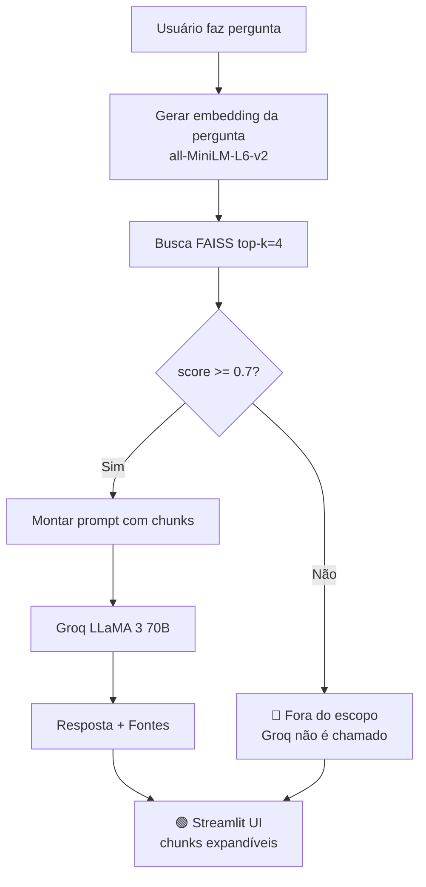

# 🛰️ Space RAG — Assistente da Nova Economia Espacial

Pipeline RAG (Retrieval-Augmented Generation) especializado em domínios espaciais:
satélites, clima, agricultura geoespacial, monitoramento ambiental e exploração espacial.

## Arquitetura



## Justificativas Técnicas

**Embedding model:** `sentence-transformers/all-MiniLM-L6-v2`
- 100% local, sem API key, ~80MB
- 384 dimensões, rápido para PoC
- Benchmark MTEB: top tier para português e inglês

**Vector Store:** FAISS-CPU
- Sem servidor, persiste em disco como arquivo
- Busca vetorial em milissegundos para coleções pequenas (<100k chunks)
- `similarity_search_with_relevance_scores` retorna scores [0,1] (maior = mais similar)

**LLM:** Groq API (LLaMA 3 70B)
- Tier gratuito com alta velocidade de inferência
- Latência baixa (~1-3s por resposta)
- Obtenha sua chave em: https://console.groq.com

**Threshold 0.7:** valor conservador que elimina chunks semanticamente distantes.
Ajuste em `src/config.py → SIMILARITY_THRESHOLD` conforme seus documentos.

## Instalação

```bash
git clone <url-do-repositorio>
cd space-rag
pip install -r requirements.txt
cp .env.example .env
# Edite .env e insira sua GROQ_API_KEY
```

## Execução

```bash
# Opcional: construir índice manualmente (o app faz isso automaticamente)
python src/ingest.py

# Subir a interface
streamlit run app.py
```

Acesse em: `http://localhost:8501`

## Exemplos de Perguntas e Respostas

### Domínio: Exploração Espacial
**Pergunta:** "O que é o programa Artemis e quais são seus objetivos?"

**Resposta:** O programa Artemis da NASA tem como objetivo retornar humanos à Lua até 2026...
**Chunks:** `nasa_artemis.txt` (score: 0.89)

---

### Domínio: Monitoramento Ambiental
**Pergunta:** "Como o INPE detecta desmatamento na Amazônia em tempo real?"

**Resposta:** O sistema DETER emite alertas de desmatamento com frequência de até 16 dias...
**Chunks:** `inpe_queimadas.txt` (score: 0.84)

---

### Domínio: Telecomunicações Espaciais
**Pergunta:** "Quantos satélites tem o Starlink e qual é a latência?"

**Resposta:** Em 2024, o Starlink conta com mais de 6.000 satélites ativos, com latências de 20-60ms...
**Chunks:** `starlink_telecomunicacoes.txt` (score: 0.91)

---

### Fora do Escopo
**Pergunta:** "Qual a receita do bolo de cenoura?"

**Resposta:** 🔴 Não encontrei documentos relevantes na base de conhecimento sobre esse tema. Minha especialidade é a nova economia espacial...

## Testes

```bash
pytest tests/ -v
```

Esperado: 10 testes passando (config: 4, ingest: 2, retriever: 4, chain: 4 = 14 total).

## Estrutura do Projeto

```
space-rag/
├── docs/                        # Documentos fonte
│   ├── nasa_artemis.txt         # Exploração espacial
│   ├── esa_copernicus.txt       # Monitoramento ambiental
│   ├── inpe_queimadas.txt       # Queimadas e desmatamento
│   ├── starlink_telecomunicacoes.txt  # Telecomunicações
│   └── agricultura_geoespacial.txt    # Agricultura de precisão
├── vector_store/                # Índice FAISS (gerado na 1ª execução)
├── src/
│   ├── config.py                # Constantes globais
│   ├── ingest.py                # Pipeline de ingestão
│   ├── retriever.py             # Busca + filtro de threshold
│   └── chain.py                 # Prompt + Groq
├── tests/                       # Testes unitários
├── app.py                       # Streamlit UI
├── pytest.ini
├── .env.example
└── requirements.txt
```

## Requisitos

- Python 3.11+
- GROQ_API_KEY (gratuita em https://console.groq.com)
- ~500MB de espaço em disco (modelos sentence-transformers)
- Internet apenas para: primeira execução (download do modelo) e chamadas ao Groq API
